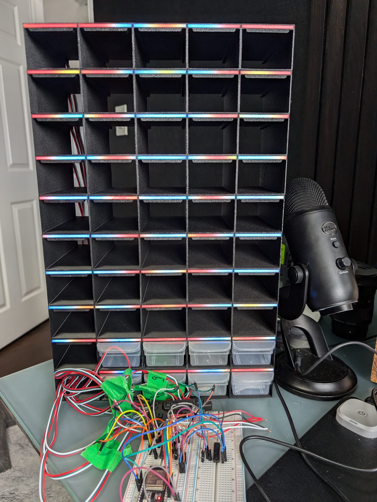

# WLED fork with support for 16 parallel strips with ESP32S3 LCD driver

The original readme is located at [readme-original.md](readme-original.md)

The latest version of WLED adopted NeoPixelBus 2.8.0 but unfortunately
the ESP32S3 LCD driver was not merged until a later version.

This fork uses NeoPixelBus 2.8.3 and defaults to using the LCD driver for
all outputs on ESP32S3.

This is confirmed working with the small-parts-bin project driving 10 parallel strips.

